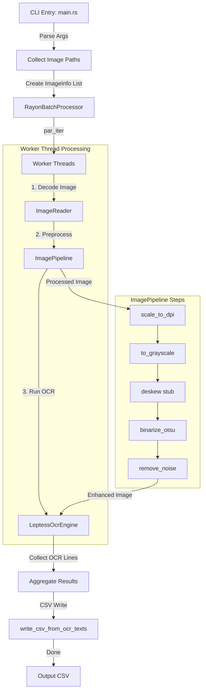

# Table-OCR Workflow & Performance Optimization Plan

This document provides a detailed overview of the current execution workflow of the **Table-OCR** CLI tool, highlights the critical performance bottlenecks identified in the codebase, and proposes actionable optimization strategies to maximize throughput and minimize CPU overhead.

---

## 1. Workflow Architecture

`Table-OCR` is designed as a modular, pipeline-based CLI tool for batch OCR processing. It separates CLI handling, batch coordination, image preprocessing, OCR extraction, and result formatting.



### Detailed Execution Steps

1. **CLI Argument Parsing & Initial Setup** ([main.rs](file:///C:/Users/nadol/projects/table-ocr/src/main.rs)):
   - Parses parameters like target DPI, column boundaries, number of columns, and language.
   - Configures tracing subscribers (Chrome Trace exporter and console logging).
   - Scans the input directory for supported image formats (PNG, JPG, BMP, etc.).

2. **Parallel Batch Coordination** ([batch_processor.rs](file:///C:/Users/nadol/projects/table-ocr/src/infrastructure/parallel/batch_processor.rs)):
   - Leverages `rayon` to spawn parallel iterators (`par_iter`) across available CPU cores.
   - Decodes each image into a `DynamicImage` instance on a worker thread.

3. **Image Preprocessing Pipeline** ([pipeline.rs](file:///C:/Users/nadol/projects/table-ocr/src/infrastructure/image_processing/pipeline.rs)):
   - **Scale to DPI**: Upscales low-DPI images to achieve a target resolution (default width 3000px) using the high-quality but CPU-intensive `FilterType::Lanczos3` filter.
   - **Grayscale Conversion**: Converts the image into a grayscale 8-bit luma channel (`Luma8`).
   - **Deskew**: Stub for automatic rotation/deskewing (currently returns image as-is).
   - **Otsu Binarization**: Dynamically calculates the global threshold and converts the image to monochrome.
   - **Noise Removal**: Sequentially applies a median filter (radius 1) and morphological operations (opening and closing with L1 norm) to smooth text contours and clear background noise.

4. **Tesseract OCR Recognition** ([tesseract.rs](file:///C:/Users/nadol/projects/table-ocr/src/infrastructure/ocr/tesseract.rs)):
   - Instantiates a fresh `LepTess` context for the image.
   - Serializes the processed `DynamicImage` to PNG format in memory.
   - Hands the PNG bytes to Tesseract via memory buffers.
   - Executes layout analysis and extracts lines of text.

5. **CSV Formatting & Output** ([csv_export.rs](file:///C:/Users/nadol/projects/table-ocr/src/csv_export.rs)):
   - Aggregates the lines extracted from all images and chunks them into structured rows based on the column configuration.
   - Outputs the results into the target CSV.

---

## 2. Identified Performance Bottlenecks

### ⚠️ Bottleneck 1: Frequent Tesseract Engine Initialization
* **Location:** [tesseract.rs:L22](file:///C:/Users/nadol/projects/table-ocr/src/infrastructure/ocr/tesseract.rs#L22) & [tesseract.rs:L54](file:///C:/Users/nadol/projects/table-ocr/src/infrastructure/ocr/tesseract.rs#L54)
* **Description:** The engine creates a new `LepTess` instance for *every single image* via `LepTess::new(None, lang)?`. Initializing Tesseract is computationally heavy: it performs I/O to load language training data (e.g. `eng.traineddata`), instantiates dictionaries, and parses config parameters.
* **Impact:** In batch operations, this initialization overhead dominates the OCR step.

### ⚠️ Bottleneck 2: Inefficient Image Serialization for Tesseract
* **Location:** [tesseract.rs:L32](file:///C:/Users/nadol/projects/table-ocr/src/infrastructure/ocr/tesseract.rs#L32) & [tesseract.rs:L63](file:///C:/Users/nadol/projects/table-ocr/src/infrastructure/ocr/tesseract.rs#L63)
* **Description:** The pipeline converts `DynamicImage` to PNG bytes using `image::write_to` to pass it to `LepTess::set_image_from_mem`. The PNG encoder compresses the image data using the DEFLATE algorithm, which is CPU-intensive. Leptonica then immediately decompresses it back into raw pixels.
* **Impact:** Unnecessary CPU cycles spent on double compression/decompression on every single frame.

### ⚠️ Bottleneck 3: CPU-Intensive Image Resizing Filter
* **Location:** [scaler.rs:L40](file:///C:/Users/nadol/projects/table-ocr/src/infrastructure/image_processing/scaler.rs#L40)
* **Description:** `scale_to_dpi` uses `FilterType::Lanczos3` to scale images up. Lanczos3 is a high-quality sinc filter requiring a wide 6x6 pixel neighborhood check, making it extremely slow.
* **Impact:** Major CPU bottle-neck during the image-scaling phase.

### ⚠️ Bottleneck 4: Heavy Sequential Preprocessing Steps
* **Location:** [noise_removal.rs:L12-L20](file:///C:/Users/nadol/projects/table-ocr/src/infrastructure/image_processing/noise_removal.rs#L12-L20)
* **Description:** The noise removal phase executes three heavy filters sequentially: `median_filter`, morphological `open`, and morphological `close`. Each of these steps sweeps the image pixel-by-pixel, calculating local neighborhood rankings and norms.
* **Impact:** High computational complexity, especially on large upscaled images (>=3000px width).

---

## 3. Actionable Optimization Proposals

### 🚀 Optimization 1: Thread-Local Tesseract Reuse (Engine Pooling)
Instead of allocating a Tesseract instance per image, reuse instances using thread-local storage. This ensures each Rayon worker thread initializes the engine exactly once and reuses it for all images assigned to that thread.

#### Proposed Implementation:
```rust
use std::cell::RefCell;

thread_local! {
    static TESS_ENGINE: RefCell<Option<LepTess>> = RefCell::new(None);
}

// In LeptessOcrEngine:
fn get_or_init_engine(&self, lang: &str) -> Result<LepTess> {
    TESS_ENGINE.with(|cell| {
        let mut opt = cell.borrow_mut();
        if opt.is_none() || opt.as_ref().unwrap().get_source_lang() != lang {
            let mut lt = LepTess::new(None, lang)?;
            lt.set_variable(Variable::TesseditPagesegMode, "6")?;
            *opt = Some(lt);
        }
        // Clone/Retrieve is tricky since LepTess is not Clone.
        // Instead, we should pass a closure to execute OCR within the thread-local scope,
        // or return a wrapper if mutable access can be safely managed.
    })
}
```
*Alternatively, use Rayon's thread-pool configuration to initialize thread-specific state upon thread startup.*

### 🚀 Optimization 2: Switch to BMP or Raw Pixels for Memory Loading
Since Leptonica has built-in support for BMP, switching the memory serialization format from `ImageFormat::Png` to `ImageFormat::Bmp` is a drop-in change that completely eliminates compression overhead.

#### Proposed Implementation:
```diff
- image.write_to(&mut Cursor::new(&mut bytes), ImageFormat::Png)?;
+ image.write_to(&mut Cursor::new(&mut bytes), ImageFormat::Bmp)?;
```
*Writing BMP has near-zero overhead because it simply writes a standard header followed by uncompressed raw pixel values.*

### 🚀 Optimization 3: Use Faster Resizing Filters
Replace the heavy `Lanczos3` filter with a faster alternative like `Triangle` (bilinear) or `CatmullRom` (cubic). The minor loss in visual fidelity does not negatively affect Tesseract OCR accuracy, but it reduces resizing time significantly.

#### Proposed Implementation:
```diff
- img.resize(new_w, new_h, FilterType::Lanczos3)
+ img.resize(new_w, new_h, FilterType::Triangle) // or CatmullRom
```

### 🚀 Optimization 4: Optional Preprocessing Flags & Vectorization
For clean source documents, noise removal is often redundant.
- Introduce CLI flags like `--skip-denoise` to bypass median filtering and morphological operations.
- Optimize the Otsu binarization loop using iterators or in-place modification.

#### Proposed Implementation:
```rust
pub fn binarize_otsu_inplace(mut gray: ImageBuffer<Luma<u8>, Vec<u8>>) -> DynamicImage {
    let p = otsu_level(&gray);
    gray.pixels_mut().for_each(|pixel| {
        pixel[0] = if pixel[0] > p { 255 } else { 0 };
    });
    DynamicImage::ImageLuma8(gray)
}
```

---

## 4. Performance Measurement & Profiling

To validate the impact of these changes, we can leverage the built-in profiling utilities in the workspace:

1. **Chrome Tracing (`tracing-chrome`)**:
   - Running the tool generates a JSON trace file in the current directory.
   - Open [chrome://tracing](chrome://tracing) or [ui.perfetto.dev](https://ui.perfetto.dev) and load the trace file to visualize where worker threads are spending their time.

2. **Heap Profiling (`dhat`)**:
   - Run the binary with the `dhat-heap` feature enabled to check allocation patterns:
     ```bash
     cargo run --features dhat-heap -- --input-dir ./files/numbers1 --output ./output/out.csv --columns 1
     ```

3. **Criterion Micro-benchmarks**:
   - Execute the benchmark suite to isolate image preprocessing performance:
     ```bash
     cargo bench
     ```

> [!IMPORTANT]
> **System Dependencies Note:**  
> Since `table-ocr` links against the native C libraries `leptonica` and `tesseract` (via `leptonica-sys` and `tesseract-sys`), local commands like `cargo test`, `cargo run`, and `cargo bench` require these development libraries to be installed on the host system (e.g., using `vcpkg` on Windows or `apt-get` on Linux). Alternatively, you can run cargo commands inside a Docker environment that already packages these dependencies.

