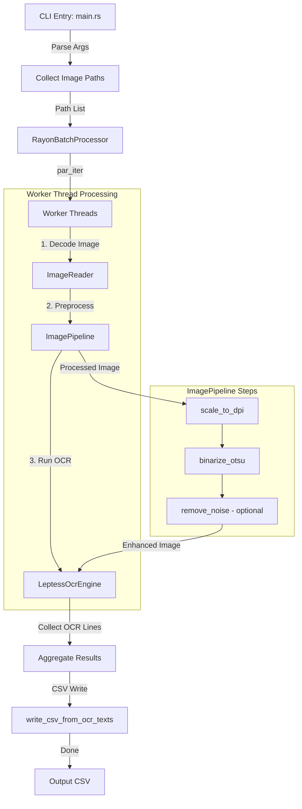

# Table-OCR Workflow & Performance Notes

This document describes the current execution workflow of the **Table-OCR** CLI tool and records the performance characteristics of the batch OCR pipeline.

---

## 1. Workflow Architecture

`Table-OCR` is a pipeline-based CLI tool for batch OCR processing: CLI handling, batch coordination, image preprocessing, OCR extraction, and CSV formatting.



### Detailed Execution Steps

1. **CLI Argument Parsing & Initial Setup** ([main.rs](file:///C:/Users/nadol/projects/table-ocr/src/main.rs)):
   - Parses parameters like target DPI, column boundaries, number of columns, and language.
   - Scans the input directory for supported image formats (PNG, JPG, BMP, etc.).

2. **Parallel Batch Coordination** ([batch_processor.rs](file:///C:/Users/nadol/projects/table-ocr/src/infrastructure/parallel/batch_processor.rs)):
   - Leverages `rayon` to spawn parallel iterators (`par_iter`) across available CPU cores.
   - Decodes each image into a `DynamicImage` instance on a worker thread.

3. **Image Preprocessing Pipeline** ([pipeline.rs](file:///C:/Users/nadol/projects/table-ocr/src/infrastructure/image_processing/pipeline.rs)):
   - **Scale to DPI**: Upscales low-DPI images to achieve a target resolution (default width 3000px) using the fast `FilterType::Triangle` filter.
   - **Otsu Binarization**: Converts to grayscale, computes the global threshold and maps the image to monochrome in place.
   - **Noise Removal** (optional, skipped with `--skip-denoise`): Applies a median filter (radius 1) and morphological opening/closing (L1 norm) in place.

4. **Tesseract OCR Recognition** ([tesseract.rs](file:///C:/Users/nadol/projects/table-ocr/src/infrastructure/ocr/tesseract.rs)):
   - Reuses one `LepTess` context per worker thread (thread-local cache keyed by language).
   - Serializes the processed `DynamicImage` to uncompressed BMP bytes in memory.
   - Hands the BMP bytes to Tesseract via memory buffers.
   - Executes layout analysis and extracts lines of text.

5. **CSV Formatting & Output** ([csv_export.rs](file:///C:/Users/nadol/projects/table-ocr/src/csv_export.rs)):
   - Aggregates the lines extracted from all images and chunks them into structured rows based on the column configuration.
   - Outputs the results into the target CSV.

---

## 2. Performance

All previously identified bottlenecks are resolved:

- **Tesseract engine reuse**: one `LepTess` per worker thread, cached in a `thread_local!` slot keyed by language — no per-image engine initialization (traineddata I/O, dictionaries, config parsing).
- **BMP serialization**: images are handed to Leptonica as uncompressed BMP, removing PNG deflate/inflate from every frame.
- **Faster resizing**: `FilterType::Triangle` instead of `Lanczos3`.
- **In-place preprocessing**: the Otsu mapping runs on the existing buffer, and noise removal uses `open_mut`/`close_mut` to avoid two full-image copies.
- **Optional denoise**: `--skip-denoise` bypasses median filtering and morphological operations for clean inputs.

### Measured results

Criterion benchmarks (`pipeline_*`, `resize_*`) on `files/IMG_4335.png` (1284x2778, upscaled to 3000x6492) inside Docker Desktop (16 vCPU, shared host — expect ±15% noise):

| Benchmark | Median |
| --- | --- |
| `pipeline_full` (scale + binarize + denoise) | ~5.1 s |
| `pipeline_skip_denoise` (scale + binarize) | ~1.9 s |
| `resize_lanczos3` | ~2.3–2.4 s |
| `resize_triangle` / `resize_catmullrom` | ~1.9–2.1 s |

- **Noise removal dominates preprocessing** (~3 s/image, roughly 60% of the pipeline): `--skip-denoise` is the largest single win.
- At 3000px width the resize is memory-bandwidth bound, so Triangle/CatmullRom only gain ~10–20% over Lanczos3.
- Binarization is effectively free next to resize and denoise.
- **Fidelity caveat:** changing the resize filter changes binarized pixels, so OCR output shifts too — on a 15-image sample ~16% of CSV lines differed from the Lanczos3 baseline. If fidelity outweighs the ~0.4 s/image, use `CatmullRom` or restore `Lanczos3`.

### How to measure

The tool runs only in Docker (see [README.md](file:///C:/Users/nadol/projects/table-ocr/README.md)); `cargo bench` and end-to-end timing need the native Leptonica/Tesseract libraries from the project `Dockerfile`.

1. **Criterion micro-benchmarks** (image preprocessing in isolation):
   ```bash
   docker run --rm --entrypoint cargo -v "${PWD}/src:/app/src" -v "${PWD}/benches:/app/benches" \
     -v "${PWD}/Cargo.toml:/app/Cargo.toml" -v "${PWD}/Cargo.lock:/app/Cargo.lock" \
     -w /app table-ocr:latest bench --bench image_processing
   ```

2. **End-to-end timing in Docker** — compare configurations on the same input folder, e.g. with and without noise removal:
   ```bash
   docker run --rm -v "${PWD}/files/numbers1:/data/images:ro" -v "${PWD}/output:/data/output" table-ocr --input-dir /data/images --output /data/output/out.csv --columns 1 --skip-denoise
   ```

> [!IMPORTANT]
> **System Dependencies Note:**  
> Since `table-ocr` links against the native C libraries `leptonica` and `tesseract` (via `leptonica-sys` and `tesseract-sys`), local commands like `cargo test`, `cargo run`, and `cargo bench` require these development libraries to be installed on the host system (e.g., using `vcpkg` on Windows or `apt-get` on Linux). Alternatively, you can run cargo commands inside a Docker environment that already packages these dependencies.
